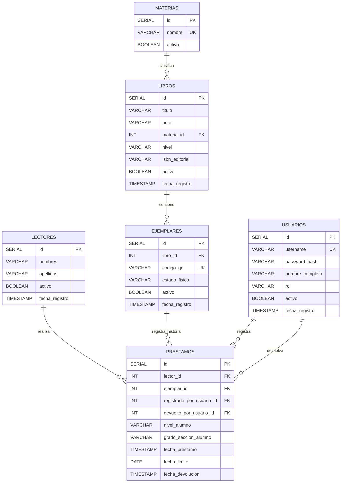

# DER definitivo de la versión 1.0

## Diagrama oficial

El diagrama definitivo es [`docs/Modelo_Logico_Biblioteca_v1.0.png`](../../Modelo_Logico_Biblioteca_v1.0.png). Fue contrastado con el capítulo 8 y el Anexo A del Documento Maestro v1.0.

## Relaciones validadas

- Una materia tiene muchos libros; cada libro pertenece a una materia.
- Un libro tiene muchos ejemplares; cada ejemplar pertenece a un libro.
- Un lector puede tener muchos préstamos históricos.
- Un ejemplar puede tener muchos préstamos históricos, pero solo uno activo simultáneamente.
- Un usuario puede registrar préstamos y confirmar devoluciones.

## Restricciones que deberá materializar la Semana 2

- `usuarios.username`, `materias.nombre` y `ejemplares.codigo_qr` son únicos.
- `prestamos.fecha_devolucion IS NULL` identifica un préstamo activo.
- Un índice o restricción única parcial impedirá más de un préstamo activo por ejemplar.
- Las operaciones de préstamo y devolución serán transaccionales.
- Los valores de rol, nivel y estado físico se limitarán a los dominios definidos.

Estas restricciones se documentan aquí para cerrar el diseño. El archivo `schema.sql` no se crea durante la Semana 1.
